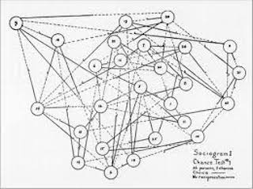

## {.title-slide-custom}

::: {.title-block}
**Introduction to Networks**
:::

::: {.subtitle-block}
Social Network Analysis Workshop
:::

::: {.author-block}
Dr Clemens Jarnach
:::

---

## Outline {.section-slide}

::: {.columns}
::: {.column width="50%"}
**Part I — Concepts**

1. What are Networks?
2. Nodes and Ties
3. Levels of Analysis
4. Structure as Cause
5. Structural Holes
:::
::: {.column width="50%"}
**Part II — Context**

6. A Brief Intellectual History
7. Moreno and Sociometry
8. Field Development
9. Why R?
:::
:::

---

# Part I — Concepts {.part-title}

---

## What are Networks?

::: {.beamer-block}
**Core idea**

A way of thinking about the world that shifts attention from *individual entities* to the **relationships between them**.
:::

::: {.fragment}
::: {.columns}
::: {.column width="50%"}
**Classic question:**

> *What* is something?
:::
::: {.column width="50%"}
**Network question:**

> *How is it connected* — and what do those connections imply?
:::
:::
:::

---

## Nodes and Ties

::: {.columns}
::: {.column width="48%"}
**Nodes** can be almost anything:

- People, organisations, countries
- Genes, web pages, neurons
- Cities, firms, teams
:::
::: {.column width="48%"}
**Ties** are the relationships:

- Friendship, collaboration
- Communication, trade
- Trust, conflict, flows
:::
:::

::: {.fragment}
::: {.beamer-alert-block}
**Why this matters**

Ties interlink through shared nodes, creating **chains and paths** that connect distant parts of a system — enabling *indirect* influence invisible to attribute-level analysis.
:::
:::

---

## Social Networks Specifically

When nodes are **active social agents** (individuals, teams, firms, cities) connected by **social relationships**, we enter the domain of *social network analysis*.

::: {.fragment}
::: {.beamer-example-block}
**Social ties include:**
friendship · collaboration · communication · trade · trust · conflict
:::
:::

::: {.fragment}
Social networks operate at **multiple levels simultaneously** — each level reveals different phenomena.
:::

---

## Levels of Analysis

::: {.columns}
::: {.column width="33%"}
::: {.level-card}
**Dyad**

Pairwise relationships between two actors.

*Do actors who share business ties also develop affective ones?*
:::
:::
::: {.column width="33%"}
::: {.level-card}
**Node**

Individual positions within the network.

*Do people with more connections fare better in job markets?*
:::
:::
::: {.column width="33%"}
::: {.level-card}
**Network**

Global structural properties.

*Do tightly connected networks diffuse information faster?*
:::
:::
:::

---

## Structure is Causally Consequential

::: {.beamer-block}
**Central theoretical claim**

An actor's **position** in a network shapes the constraints and opportunities they encounter. Structure is not merely descriptive — it is *causally consequential*.
:::

::: {.fragment}
The same logic applies at the collective level:

- A sports team of talented individuals may **underperform** if collaboration structures are poor
- An organisation may **fail to innovate** not because members lack creativity, but because information cannot flow across structural gaps between teams
:::

---

## Structural Holes

::: {.columns}
::: {.column width="60%"}
**Absence** carries meaning too.

Gaps between otherwise dense clusters — what Burt [-@burtStructuralHolesGood2004] called **structural holes** — can be as consequential as ties themselves.

::: {.fragment}
::: {.beamer-alert-block}
**The broker advantage**

The broker who spans a gap between two disconnected groups holds a position of **informational and strategic advantage** that no attribute-level analysis would reveal.
:::
:::
:::
::: {.column width="38%"}
```{=html}
<svg viewBox="0 0 280 300" xmlns="http://www.w3.org/2000/svg" style="width:100%;max-height:320px;">
  <!-- Edges cluster 1 -->
  <line x1="80" y1="80"  x2="40"  y2="180" stroke="#aaa" stroke-width="2"/>
  <line x1="80" y1="80"  x2="130" y2="180" stroke="#aaa" stroke-width="2"/>
  <line x1="40" y1="180" x2="130" y2="180" stroke="#aaa" stroke-width="2"/>
  <!-- Edges broker -->
  <line x1="130" y1="180" x2="200" y2="150" stroke="#aaa" stroke-width="2"/>
  <!-- Edges cluster 2 -->
  <line x1="200" y1="150" x2="230" y2="240" stroke="#aaa" stroke-width="2"/>
  <line x1="200" y1="150" x2="170" y2="240" stroke="#aaa" stroke-width="2"/>
  <line x1="230" y1="240" x2="170" y2="240" stroke="#aaa" stroke-width="2"/>
  <!-- Cluster 1 nodes -->
  <circle cx="80"  cy="80"  r="22" fill="#2980b9"/>
  <circle cx="40"  cy="180" r="22" fill="#2980b9"/>
  <circle cx="130" cy="180" r="22" fill="#2980b9"/>
  <!-- Broker node -->
  <circle cx="200" cy="150" r="24" fill="#e74c3c" stroke="#fff" stroke-width="3"/>
  <!-- Cluster 2 nodes -->
  <circle cx="230" cy="240" r="22" fill="#27ae60"/>
  <circle cx="170" cy="240" r="22" fill="#27ae60"/>
  <!-- Labels -->
  <text x="80"  y="85"  text-anchor="middle" fill="white" font-size="12" font-weight="bold">A</text>
  <text x="40"  y="185" text-anchor="middle" fill="white" font-size="12" font-weight="bold">B</text>
  <text x="130" y="185" text-anchor="middle" fill="white" font-size="12" font-weight="bold">C</text>
  <text x="200" y="155" text-anchor="middle" fill="white" font-size="11" font-weight="bold">Broker</text>
  <text x="230" y="245" text-anchor="middle" fill="white" font-size="12" font-weight="bold">D</text>
  <text x="170" y="245" text-anchor="middle" fill="white" font-size="12" font-weight="bold">E</text>
  <!-- Structural hole label -->
  <text x="165" y="130" text-anchor="middle" fill="#888" font-size="10" font-style="italic">structural</text>
  <text x="165" y="143" text-anchor="middle" fill="#888" font-size="10" font-style="italic">hole</text>
  <!-- Legend -->
  <circle cx="30" cy="275" r="8" fill="#2980b9"/>
  <text x="44"  cy="275" y="279" font-size="10" fill="#444">Cluster 1</text>
  <circle cx="105" cy="275" r="8" fill="#e74c3c"/>
  <text x="119" cy="275" y="279" font-size="10" fill="#444">Broker</text>
  <circle cx="185" cy="275" r="8" fill="#27ae60"/>
  <text x="199" cy="275" y="279" font-size="10" fill="#444">Cluster 2</text>
</svg>
```
:::
:::

---

# Part II — Context {.part-title}

---

## A Brief Intellectual History

Network analysis grew from contributions across **multiple disciplines**:

::: {.columns}
::: {.column width="33%"}
::: {.discipline-card .math}
**Mathematics**

Graph theory and topology
:::
:::
::: {.column width="33%"}
::: {.discipline-card .anthro}
**Anthropology**

Kinship systems and group structure
:::
:::
::: {.column width="33%"}
::: {.discipline-card .socio}
**Sociology & Psychology**

Theories of social groups and process
:::
:::
:::

::: {.fragment}
Its modern form is often traced to **Jacob Moreno**'s work in the early 20th century.
:::

---

## Moreno and Sociometry

::: {.columns}
::: {.column width="55%"}
Jacob Moreno [-@morenoWhoShallSurvive1934; -@morenoSociometryExperimentalMethod1951] defined the study of social relations as **sociometry** and invented:

- The **Sociogram** — a visual representation of relational structure
- The **Social Atom** model — concentric circles mapping relational proximity

::: {.beamer-example-block}
The Social Atom places the individual at the nucleus, with intimate bonds in the inner ring and broader acquaintances in the outer ring.
:::
:::
::: {.column width="43%"}
{width=100%}
:::
:::

---

## Field Development

::: {.timeline}
::: {.timeline-item}
**Early 20th C.** — Moreno's sociometry; Gestalt psychology; anthropological fieldwork
:::
::: {.timeline-item}
**1950s–70s** — Graph-theoretic formalism; small group studies; kinship networks in anthropology
:::
::: {.timeline-item}
**1970s–80s** — Granovetter on weak ties; Burt on structural holes; White's structural sociology
:::
::: {.timeline-item}
**1990s–2000s** — Small-world networks (Watts & Strogatz); scale-free networks (Barabási & Albert); statistical network models (ERGMs, SBMs)
:::
::: {.timeline-item}
**2010s–present** — Massive-scale empirical networks; causal inference in networks; temporal and multilayer networks
:::
:::

---

## Three Converging Forces (1990s–)

Interest in network science **exploded** from the 1990s onwards, driven by:

::: {.fragment}
::: {.force-card}
**1 · Influential new theories**

Small worlds, scale-free networks, preferential attachment — transforming our theoretical vocabulary
:::
:::

::: {.fragment}
::: {.force-card}
**2 · Computational power**

Dramatic advances made **large-scale** network analysis tractable for the first time
:::
:::

::: {.fragment}
::: {.force-card}
**3 · Statistical models**

Moved the field beyond description toward **formal inference** — ERGMs, SBMs, latent space models
:::
:::

---

## Why R?

::: {.columns}
::: {.column width="55%"}
**R** has become one of the richest environments for network analysis:

| Package | Purpose |
|---------|---------|
| `igraph` | Core graph structures & algorithms |
| `tidygraph` | Tidy interface to graph data |
| `ggraph` | Network visualisation |
| `statnet` | Statistical network modelling |

R's broader ecosystem (tidyverse, spatial packages, multilevel modelling) integrates naturally with network methods.
:::
::: {.column width="43%"}
::: {.beamer-block}
**Install before the first session**

```r
install.packages(c(
  "tidyverse", "janitor",
  "readxl", "haven",
  "igraph", "tidygraph",
  "ggraph", "statnet",
  "intergraph",
  "RColorBrewer", "viridis"
))
```
:::
:::
:::

---

## Summary {.section-slide}

::: {.columns}
::: {.column width="50%"}
**Key concepts**

- Networks = nodes + ties
- Indirect connection matters
- Multiple levels of analysis
- Structure is causally consequential
- Structural holes & brokerage
:::
::: {.column width="50%"}
**Key figures**

- Jacob Moreno (sociometry)
- Mark Granovetter (weak ties)
- Ronald Burt (structural holes)
- Duncan Watts (small worlds)
- Albert-László Barabási (scale-free)
:::
:::

::: {.fragment}
::: {.beamer-alert-block}
**Next:** Formal graph theory — nodes, edges, adjacency matrices, and network measures
:::
:::

---

## References {.references-slide}

::: {#refs}
:::
